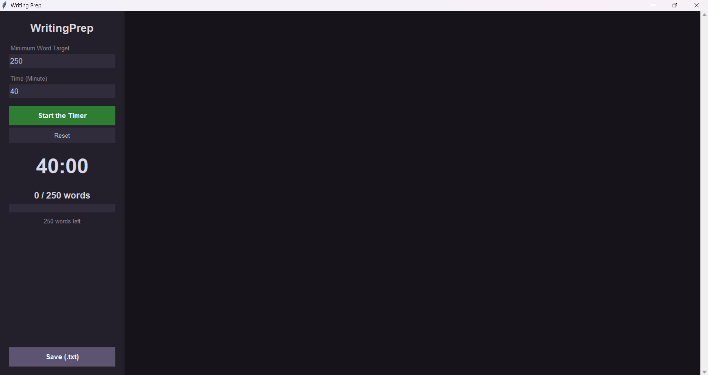

# Writing Prep

A distraction-free, dark-mode desktop essay editor for English writing exam practice (IELTS, TOEFL, Proficiency). It tracks your minimum word count in real time and runs a countdown timer so you can practice under exam conditions.



## Features

- **Live word counter** that compares your text against a minimum word target
- **Progress bar** that goes from red to orange to green as you approach the target, with a "Target Reached!" message
- **Countdown timer** with start, pause/resume and reset, and a "Time is up!" summary when the time ends
- **Distraction-free dark mode** workspace
- **Save as .txt** so you can keep your essays

## Requirements

- Python 3.8 or newer
- Tkinter (included with the standard Python installer on Windows and macOS; on some Linux distributions install it with `sudo apt install python3-tk`)

No external libraries are needed. The UI uses the Poppins font; if it is not installed, Tkinter falls back to a default font.

## Getting Started

```bash
git clone https://github.com/kayraonat/writing-prep.git
cd writing-prep
python writing_prep.py
```

## How to Use

1. Enter your **Minimum Word Target** in the left panel.
2. Enter the **Time (Minute)** you want to practice for.
3. Click **Start the Timer** and write your essay in the main text area.
4. Watch the word count and progress bar update as you type.
5. When time is up, review your result and click **Save (.txt)** to export your essay.

### Common exam settings

| Exam task | Minimum words | Time |
|-----------|---------------|------|
| IELTS Writing Task 1 | 150 | 20 min |
| IELTS Writing Task 2 | 250 | 40 min |

## Project Structure

The app is a single file, `writing_prep.py`, organized in four sections:

1. Module imports and color constants
2. `WritingPrepApp` class and interface setup (`__init__`, left and right panels)
3. Logic functions (word counting, stats, timer, saving)
4. `main()` entry point

## Ideas for the Future

- One-click exam presets (IELTS Task 1/2, TOEFL and others)
- Paragraph counter
- Exam mode that disables copy-paste
- Packaging as a standalone `.exe`
